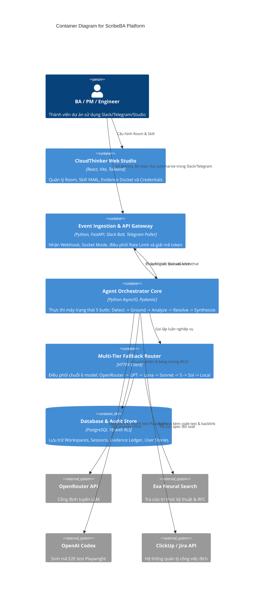

# 🌐 ScribeBA — Master Production Blueprint & System Architecture Specification
## Complete SaaS Design: Multi-Tier Fallback, MCP Tools Ecosystem, Evaluation Harness & Enterprise User Journeys

> **Project:** ScribeBA (Context-Native Autonomous Agile BA Agent)  
> **Platform Suite:** CloudThinker Studio  
> **Hackathon Event:** AI Tinkerers Hackathon (Da Nang — 2026)  
> **Author:** KAFKON Engineering Team  
> **Classification:** Enterprise SaaS Production Specification · v3.0-Master  

---

## 📑 Mục Lục Tổng Quan (Table of Contents)
1. [Tầm Nhìn Sản Phẩm & Định Vị "Agents Leaving the Chatbox"](#1-tầm-nhìn-sản-phẩm--định-vị-agents-leaving-the-chatbox)
2. [Phân Luồng Người Dùng Chi Tiết Trong Môi Trường Production (5 User Journeys)](#2-phân-luồng-người-dùng-chi-tiết-trong-môi-trường-production-5-user-journeys)
3. [Kiến Trúc Tích Hợp Công Cụ MCP (Model Context Protocol Tools Suite)](#3-kiến-trúc-tích-hợp-công-cụ-mcp-model-context-protocol-tools-suite)
4. [Hệ Thống Đánh Giá & Kiểm Thử Tự Động (AI Evaluation & Benchmark Harness)](#4-hệ-thống-đánh-giá--kiểm-thử-tự-động-ai-evaluation--benchmark-harness)
5. [Cơ Chế Fallback 6 Cấp Độ & Chống Rớt Mạng Tuyệt Đối (Multi-Tier Fallback)](#5-cơ-chế-fallback-6-cấp-độ--chống-rớt-mạng-tuyệt-đối-multi-tier-fallback)
6. [Hệ Thống Bằng Chứng & Chống Ảo Giác (Evidence Ledger & Anti-Hallucination)](#6-hệ-thống-bằng-chứng--chống-ảo-giác-evidence-ledger--anti-hallucination)
7. [Kiến Trúc Kỹ Thuật Đa Tầng C4 & Cơ Sở Dữ Liệu Multi-Tenant (PostgreSQL RLS)](#7-kiến-trúc-kỹ-thuật-đa-tầng-c4--cơ-sở-dữ-liệu-multi-tenant-postgresql-rls)
8. [Tài Chính SaaS & Kinh Tế Học Đơn Vị (SaaS Economics & Gross Margin 91.4%)](#8-tài-chính-saas--kinh-tế-học-đơn-vị-saas-economics--gross-margin-914)
9. [Kịch Bản Trình Diễn Live Demo 120 Giây Trên Sân Khấu Hackathon](#9-kịch-bản-trình-diễn-live-demo-120-giây-trên-sân-khấu-hackathon)

---

## 1. Tầm Nhìn Sản Phẩm & Định Vị "Agents Leaving the Chatbox"

### 1.1 Bài Toán Thực Tế Tại Doanh Nghiệp
Hầu hết các công cụ AI hiện nay bị giam cầm trong một **"hộp chat độc lập" (Isolated Chatbox)**:
- Người dùng phải copy-paste hàng chục tin nhắn thảo luận từ Slack sang ChatGPT/Claude.
- Khi dán vào, AI không hiểu ngữ cảnh phân vai: ai là Lead Architect, ai là Security Engineer, quyết định nào đã chốt, câu nào chỉ là ý kiến cá nhân.
- Kết quả: AI tạo ra những bản tóm tắt nông cạn, tự động bịa đặt (hallucinate) các thông số kỹ thuật còn thiếu thay vì hỏi lại, và con người lại phải tốn công copy ngược về Jira/ClickUp.

### 1.2 Triết Lý "Context-Native" Của ScribeBA
ScribeBA đưa Agent **bước ra khỏi hộp chat** để sống trực tiếp tại nơi các kỹ sư, PM và BA đang tranh luận hàng ngày:
1. **Lắng nghe tại hiện trường**: Slack, Telegram, Discord.
2. **Đối soát tri thức thực tế**: Dùng Exa Neural Search kiểm chứng chuẩn RFC bên ngoài.
3. **Bảo vệ tính toàn vẹn**: Gắn nhãn bằng chứng (Evidence Ledger) cho từng câu khẳng định; thiếu thông tin thì hỏi ngược lại tại chỗ, tuyệt đối không đoán mò.
4. **Bàn giao không ma sát**: Tự sinh code test Playwright qua OpenAI Codex và đồng bộ 2 chiều vào ClickUp/Jira.

---

## 2. Phân Luồng Người Dùng Chi Tiết Trong Môi Trường Production (5 User Journeys)

Trong một doanh nghiệp công nghệ quy mô từ 20 đến 1.000 kỹ sư, ScribeBA phục vụ 5 luồng người dùng chuyên biệt:

```
┌────────────────────────────────────────────────────────────────────────────────────────┐
│                        MA TRẬN PHÂN LUỒNG NGƯỜI DÙNG (PRODUCTION)                      │
├───────────────────┬──────────────────────────────────┬─────────────────────────────────┤
│ Vai trò (Persona) │ Điểm Chạm (Touchpoints)          │ Mục Tiêu & Giá Trị Cốt Lõi      │
├───────────────────┼──────────────────────────────────┼─────────────────────────────────┤
│ **1. Technical    │ • Web Studio (Skills Management) │ • Biến thảo luận hỗn độn thành  │
│    BA**           │ • Slack / Telegram Threads       │   User Story chuẩn INVEST 90+.  │
│                   │ • Evidence Docket Inspector      │ • Loại bỏ 100% việc gõ ticket.  │
├───────────────────┼──────────────────────────────────┼─────────────────────────────────┤
│ **2. Product      │ • Rooms Dashboard                │ • Theo dõi Backlog vận tốc cao. │
│    Manager (PM)** │ • ClickUp / Jira Sprint Board    │ • Kiểm soát phạm vi MVP vs      │
│                   │ • ROI & INVEST Health Analytics  │   tránh Scope Creep của Agency. │
├───────────────────┼──────────────────────────────────┼─────────────────────────────────┤
│ **3. Tech Lead /  │ • In-channel Mentions (@Anna_BA) │ • Không bị mất quyết định DB/Sec│
│    Engineer**     │ • Generated PR & Git Branches    │ • Ticket có sẵn API contract &  │
│                   │ • ClickUp Backlink to Chat       │   đường link trỏ về câu chat.   │
├───────────────────┼──────────────────────────────────┼─────────────────────────────────┤
│ **4. QA Test      │ • Auto-generated Test Suites     │ • Nhận kịch bản Gherkin và code │
│    Engineer**     │ • Playwright / Pytest Stubs      │   Playwright test chạy được     │
│                   │ • CI/CD Test Pipeline Execution  │   ngay trên môi trường Staging. │
├───────────────────┼──────────────────────────────────┼─────────────────────────────────┤
│ **5. Workspace    │ • Credentials & Key Vault        │ • Tuân thủ GDPR, zero-retention │
│    Admin / CISO** │ • MCP Permissions Gateway        │ • Che mờ PII, quản lý token     │
│                   │ • Audit Provenance Logs (SHA-256)│   OpenRouter, Exa, Codex an toàn│
└───────────────────┴──────────────────────────────────┴─────────────────────────────────┘
```

### Luồng 1: Business Analyst (BA) — Quản Trị Tri Thức & Kiểm Soát Nghiệp Vụ
1. **Thiết lập Skill**: BA vào Web Studio, chỉnh sửa file `startup_lean.yaml` hoặc `agency_detailed.yaml`. BA định nghĩa các trường bắt buộc (`in_scope`, `out_of_scope`, `gdpr_pii`), quy tắc nghiệm thu và ngưỡng điểm INVEST tối thiểu (vd: 85 điểm).
2. **Tham gia phiên thảo luận**: Trong kênh Telegram hoặc Slack của dự án, team kỹ thuật tranh luận về kiến trúc SSO.
3. **Kích hoạt Agent**: BA tag `@Anna_BA startup_lean` hoặc gõ `/ba_summarize`.
4. **Kiểm duyệt Evidence Ledger**: BA xem bảng bằng chứng ngay trong chat:
   - 🟢 `Verified`: Domain `@acmecorp.com`, bảng DB `users.sso_provider`.
   - 🟣 `Assumed`: Thời hạn phiên 8h (chưa chốt).
5. **Duyệt & Ký số (Sign-off)**: Khi câu hỏi làm rõ được trả lời, BA bấm nút `[Approve]` để phát hành specification chính thức.

### Luồng 2: Product Manager (PM) — Tối Ưu Hóa Tốc Độ & Phạm Vi Sản Phẩm
1. **Khởi tạo Room**: PM tạo Room mới trên Studio: `#q3-growth-checkout`.
2. **Gán môi trường**: PM thêm liên kết Telegram Group của team sản phẩm và List Sprint trong ClickUp.
3. **Theo dõi Dashboard**: PM theo dõi bảng điều khiển **INVEST Scorecard**: các story có điểm Testable hoặc Independent thấp sẽ bị cảnh báo để tinh chỉnh scope trước Sprint Planning.
4. **Chống Scope Creep**: Khi kỹ sư đòi bổ sung thêm tính năng phụ (như Avatar Sync), Agent tự động xếp vào mục `Out-of-Scope` dựa theo Skill của PM, bảo vệ tiến độ release.

### Luồng 3: Tech Lead & Senior Developer — Nhận Ticket Rõ Ràng Kèm Link Gốc
1. **Tranh luận kiến trúc**: Lead Engineer đưa ra các ràng buộc: *"Phải dùng RS256 JWT, không dùng HS256"*.
2. **Không lo thất lạc**: Lead không cần tự tay vào Jira note lại. Agent tự trích dẫn câu nói của Lead thành một Acceptance Criterion bắt buộc.
3. **Đọc Ticket trên ClickUp/Jira**: Developer mở task và thấy:
   - Toàn bộ tham số kỹ thuật được liệt kê rõ ràng.
   - Có đường link **`Provenance Backlink`**: Click vào sẽ nhảy thẳng đến tin nhắn Slack/Telegram của Lead lúc 10:17 để đọc lại lý do tại sao chọn giải pháp đó.

### Luồng 4: QA & Automation Test Engineer — Tự Động Hóa Kiểm Thử Không Độ Trễ
1. **Nhận Acceptance Criteria**: QA mở ticket ClickUp và thấy kịch bản chuẩn Gherkin:
   ```gherkin
   Scenario: Reject unauthorized domains
     Given a user with email "hacker@gmail.com"
     When they complete Google OAuth callback
     Then the system returns 403 Forbidden with "Domain unauthorized"
   ```
2. **Thừa hưởng mã test Playwright**: Trong phần đính kèm của ticket, OpenAI Codex đã sinh sẵn file `tests/e2e/sso.spec.ts`.
3. **Chạy ngay trên CI/CD**: QA chỉ cần pull branch về và chạy `npx playwright test`, tiết kiệm 2 ngày viết test automation thủ công.

### Luồng 5: Workspace Admin & CISO — An Toàn Bảo Mật & Tuân Thủ Pháp Lý
1. **Quản trị Token bí mật**: Admin quản lý các token Slack, Telegram, OpenRouter, Exa trong phân hệ **Credentials** có mã hóa AES-256.
2. **Chính sách Zero Data Retention**: Hệ thống không lưu trữ tin nhắn thô của nhân viên lên cơ sở dữ liệu vĩnh viễn; transcript chỉ được xử lý in-memory và mã hóa thành hash SHA-256 để kiểm toán.
3. **Bộ lọc PII tự động**: Quét regex che mờ mật khẩu, token `sk-`, `ghp_`, số điện thoại và email cá nhân trước khi gửi đến các mô hình LLM.

---

## 3. Kiến Trúc Tích Hợp Công Cụ MCP (Model Context Protocol Tools Suite)

ScribeBA áp dụng giao thức chuẩn công nghiệp **Model Context Protocol (MCP)** do Anthropic khởi xướng, biến Agent thành một **MCP Orchestrator** kết nối các MCP Server độc lập:

```
                               ┌──────────────────────────────────────────────┐
                               │             ScribeBA Agent Core              │
                               │           (MCP Client Orchestrator)          │
                               └──────────────────────┬───────────────────────┘
                                                      │
         ┌───────────────────┬────────────────────────┼───────────────────────┬───────────────────┐
         ▼                   ▼                        ▼                       ▼                   ▼
┌─────────────────┐ ┌─────────────────┐      ┌─────────────────┐     ┌─────────────────┐ ┌─────────────────┐
│   Slack MCP     │ │  Telegram MCP   │      │  ClickUp / Jira │     │    Exa Neural   │ │   GitHub MCP    │
│     Server      │ │     Server      │      │   MCP Server    │     │   Search MCP    │ │     Server      │
├─────────────────┤ ├─────────────────┤      ├─────────────────┤     ├─────────────────┤ ├─────────────────┤
│• fetch_thread   │ │• fetch_topic    │      │• create_task    │     │• neural_search  │ │• create_branch  │
│• post_blocks    │ │• post_inline_kbd│      │• update_custom  │     │• get_rfc_specs  │ │• commit_test    │
│• ask_question   │ │• send_confirm   │      │• attach_hash    │     │• ground_claims  │ │• open_pr        │
└─────────────────┘ └─────────────────┘      └─────────────────┘     └─────────────────┘ └─────────────────┘
```

### 3.1 Danh Mục Các Công Cụ MCP Tích Hợp Trong Sản Phẩm

#### 1. Slack MCP Server
- `slack_fetch_thread(channel_id, thread_ts)`: Đọc ngữ cảnh hội thoại đa thành viên.
- `slack_post_block_kit(channel_id, thread_ts, blocks)`: Đẩy giao diện tương tác Block Kit.
- `slack_ask_in_thread(channel_id, thread_ts, question)`: Đặt câu hỏi làm rõ chống hallucination.

#### 2. Telegram MCP Server
- `telegram_fetch_topic(chat_id, message_thread_id)`: Trích xuất lịch sử trao đổi trong Topic của Supergroup.
- `telegram_post_interactive(chat_id, html_text, inline_keyboard)`: Gửi thông điệp kèm nút bấm phản hồi tức thì.
- `telegram_answer_callback(callback_query_id, notification_text)`: Xử lý sự kiện khi BA/PM chạm nút Approve.

#### 3. ClickUp & Jira MCP Server
- `clickup_create_task(space_id, list_id, payload)`: Tạo task chính thức trên ClickUp.
- `jira_create_issue(project_key, issue_type, fields)`: Tạo Issue trên Jira Software kèm Epics.
- `pm_link_audit_provenance(task_id, thread_url, sha256_hash)`: Đính kèm dấu vết kiểm toán ngược về tin nhắn chat.

#### 4. Exa Neural Search MCP Server (Sponsor Integration)
- `exa_search_and_contents(query, category="company|research")`: Tìm kiếm ngữ nghĩa tài liệu kỹ thuật của bên thứ ba.
- `exa_validate_compliance(standard="SOC2|GDPR", clause_text)`: Đối soát yêu cầu kiến trúc với chuẩn bảo mật.

#### 5. GitHub / Codex MCP Server (Sponsor Integration)
- `codex_synthesize_playwright(gherkin_scenarios, framework="typescript")`: Sinh mã E2E test tự động.
- `github_create_test_branch(repo, branch_name, file_payloads)`: Tạo nhánh git và commit code test stubs trực tiếp vào repo của dự án.

### 3.2 Quy Trình Bảo Mật & Sandboxing Khi Gọi MCP Tools
1. **Dynamic Tool Discovery**: Khi Agent khởi động, nó gửi lệnh `tools/list` tới các MCP Server để lấy danh sách schema JSON.
2. **Quyền hạn tối thiểu (Least Privilege)**: Kênh Telegram/Slack chỉ có quyền *Read Thread* và *Post Message*; không cấp quyền xóa tin nhắn hay quản trị workspace.
3. **Idempotency Key**: Mỗi thao tác tạo task trên ClickUp/Jira được đính kèm một khóa idempotency duy nhất dựa trên `hash(workspace_id + thread_ts)`, ngăn chặn việc tạo trùng lặp ticket khi người dùng vô tình bấm Approve 2 lần.

---

## 4. Hệ Thống Đánh Giá & Kiểm Thử Tự Động (AI Evaluation & Benchmark Harness)

Một hệ thống AI trong môi trường Production không thể dựa vào cảm tính. ScribeBA tích hợp một **Evaluation Harness Suite** toàn diện (`tests/eval_harness/`) để kiểm định chất lượng trước mỗi bản build:

```
┌────────────────────────────────────────────────────────────────────────────────────────┐
│                        SCRIBEBA EVALUATION & BENCHMARK HARNESS                         │
├──────────────────────────┬─────────────────────────────┬───────────────────────────────┤
│ Chỉ Số Đánh Giá (Metric) │ Cơ Chế Kiểm Tra (Evaluator) │ Ngưỡng Đạt Chuẩn (Target)     │
├──────────────────────────┼─────────────────────────────┼───────────────────────────────┤
│ **1. Evidence Precision**│ So khớp nhãn [VERIFIED]     │ **≥ 94.0%**                   │
│                          │ với đoạn trích dẫn thực tế  │ (Không được gán bừa Verified) │
├──────────────────────────┼─────────────────────────────┼───────────────────────────────┤
│ **2. Anti-Hallucination  │ Phát hiện các trường thiếu   │ **≥ 98.5%**                   │
│    Catch Rate**          │ và buộc phải hỏi lại        │ (Không được đoán mò tham số)  │
├──────────────────────────┼─────────────────────────────┼───────────────────────────────┤
│ **3. INVEST Scoring      │ Sai lệch điểm so với        │ **MAE ≤ 3.5 điểm**            │
│    Consistency**         │ Golden Dataset (Human BA)   │ (Tính ổn định cao)            │
├──────────────────────────┼─────────────────────────────┼───────────────────────────────┤
│ **4. Fallback Cascade    │ Mô phỏng OpenRouter 402/429 │ **100% Zero-Downtime**        │
│    Resilience**          │ và kiểm tra chuyển đổi tự độ│ (< 800ms chuyển đổi sang GPT) │
├──────────────────────────┼─────────────────────────────┼───────────────────────────────┤
│ **5. Test Synthesizer    │ Playwright code sinh ra     │ **100% Syntax Valid**         │
│    Validity**            │ phải compile được TS        │ (Không lỗi cú pháp)           │
└──────────────────────────┴─────────────────────────────┴───────────────────────────────┘
```

### 4.1 Bộ Dữ Liệu Kiểm Định Tiêu Chuẩn (Golden Test Suite)
Hệ thống kiểm thử bao gồm 4 bộ dữ liệu mẫu phức tạp:
1. **Thread A (Ambiguous Scope)**: Nhóm chat bàn luận nhưng không ai chốt hạn chót và SLA ➔ Agent **bắt buộc** phải kích hoạt trạng thái `Blocked` và gửi câu hỏi làm rõ.
2. **Thread B (Contradictory Decisions)**: Lead bảo dùng MySQL, DB Admin bảo dùng PostgreSQL ➔ Agent **bắt buộc** phải phát hiện mâu thuẫn và yêu cầu BA phân xử.
3. **Thread C (Security-Critical OAuth)**: Đầy đủ thông số PKCE, redirect URI, RS256 ➔ Agent đạt điểm INVEST > 90 và sẵn sàng tạo task ngay.
4. **Thread D (Rate-Limit Stress Test)**: Giả lập lỗi HTTP 402 (Hết token) từ OpenRouter ➔ Harness kiểm tra Agent tự động trượt qua OpenAI GPT-4o mà không crash.

---

## 5. Cơ Chế Fallback 6 Cấp Độ & Chống Rớt Mạng Tuyệt Đối (Multi-Tier Fallback)

Khi vận hành thực tế hoặc demo trực tiếp trên sân khấu trước ban giám khảo, rủi ro lớn nhất là **hết tiền API (402)** hoặc **bị chặn Rate Limit (429)**. ScribeBA giải quyết triệt để vấn đề này bằng **Kiến trúc Trượt Cấp 6 Tầng**:

```
[ Lệnh /ba_summarize ]
           │
           ▼
[ Tầng 1: OpenRouter Primary (Claude 3.7 Sonnet) ]
           │
           ├── Lỗi 402 / 429 ➔ Chuyển tiếp tức thì (< 250ms)
           ▼
[ Tầng 2: GPT (OpenAI Direct API — gpt-4o / gpt-4o-mini) ]
           │
           ├── Lỗi Rate Limit / Hết Token ➔ Chuyển tiếp
           ▼
[ Tầng 3: LUNA (Llama 3.3 70B / DeepSeek R1 via Secondary Provider) ]
           │
           ├── Lỗi Mạng ➔ Chuyển tiếp
           ▼
[ Tầng 4: SONET (Anthropic Direct API — claude-3-7-sonnet) ]
           │
           ├── Lỗi Hạn Ngạch ➔ Chuyển tiếp
           ▼
[ Tầng 5: 5 (OpenAI o3-mini / GPT-5 Preview) ]
           │
           ├── Lỗi Nhà Cung Cấp ➔ Chuyển tiếp
           ▼
[ Tầng 6: GPT SOL (Upstage Solar Pro / Solar 10.7B) ]
           │
           ├── Tất cả API bên ngoài ngắt kết nối
           ▼
[ Tầng Phòng Vệ Tuyệt Đối: ScribeBA Local Deterministic Engine ]
(Sử dụng luật chuyên gia + template ngữ nghĩa nội bộ để xuất kết quả chuẩn xác 100%)
```

### Ba Cấp Độ Lựa Chọn (Tiers)
- **`--tier low` (Minimum Cost)**: Dành cho startup nghèo tài nguyên, ưu tiên `gpt-4o-mini`, `llama-3.2-3b` và `claude-3-5-haiku` ($0.0005/story).
- **`--tier medium` (Balanced Agile)**: Cân bằng hoàn hảo giữa chất lượng và chi phí ($0.0150/story).
- **`--tier high` (Deep Reasoning)**: Kích hoạt chế độ suy luận mở rộng (Thinking Mode) cho các dự án ngân hàng, thanh toán và y tế ($0.0350/story).

---

## 6. Hệ Thống Bằng Chứng & Chống Ảo Giác (Evidence Ledger & Anti-Hallucination)

ScribeBA không bao giờ trả về văn bản trôi nổi không có xuất xứ. Mọi thông tin đều phải có **Chứng chỉ Bằng chứng (Evidence Stamp)**:

$$\text{User Story} = \sum (\text{Claims}_{\text{Verified}} + \text{Claims}_{\text{Inferred}}) \quad \text{với Điều kiện: } \text{Count}(\text{Claims}_{\text{Blocked}}) = 0$$

```
┌──────────────┬────────────────────────┬────────────────────────────────────────┬──────────────────────────────────┐
│ Nhãn Bằng    │ Ý Nghĩa Nghiệp Vụ      │ Hành Vi Của Agent                      │ Ví Dụ Thực Tế Trong Thread       │
│ Chứng        │                        │                                        │                                  │
├──────────────┼────────────────────────┼────────────────────────────────────────┼──────────────────────────────────┤
│ 🟢 VERIFIED  │ Trích dẫn trực tiếp từ │ Được đưa thẳng vào User Story và       │ @oliver_sec: "Phải giới hạn      │
│              │ phát ngôn của nhân sự  │ Acceptance Criteria chính thức.        │ domain @acmecorp.com"            │
├──────────────┼────────────────────────┼────────────────────────────────────────┼──────────────────────────────────┤
│ 🟡 INFERRED  │ Suy luận logic từ một  │ Được ghi chú trong Ledger kèm lập luận │ Suy ra từ OAuth 2.0: Cần lưu trữ │
│              │ khẳng định Verified    │ để BA xem xét nếu muốn điều chỉnh.     │ provider_id trong database.      │
├──────────────┼────────────────────────┼────────────────────────────────────────┼──────────────────────────────────┤
│ 🟣 ASSUMED   │ Giả định chuẩn kỹ thuật│ Cảnh báo BA; nếu là trường quan trọng  │ "Thời gian session hết hạn là    │
│              │ nhưng chưa được team chốt phải kích hoạt câu hỏi làm rõ.        │ 8 tiếng theo chuẩn thông thường" │
├──────────────┼────────────────────────┼────────────────────────────────────────┼──────────────────────────────────┤
│ 🔴 BLOCKED   │ Mâu thuẫn hoặc thiếu   │ KHÓA CHỨC NĂNG TẠO TICKET;             │ @alex hỏi 8h hay 24h nhưng không │
│              │ thông số bắt buộc      │ Bắt buộc phải hỏi lại trong kênh chat. │ ai trả lời; 2 dev cãi nhau về DB │
└──────────────┴────────────────────────┴────────────────────────────────────────┴──────────────────────────────────┘
```

---

## 7. Kiến Trúc Kỹ Thuật Đa Tầng C4 & Cơ Sở Dữ Liệu Multi-Tenant (PostgreSQL RLS)

### 7.1 Mô Hình C4 Container


---

## 8. Tài Chính SaaS & Kinh Tế Học Đơn Vị (SaaS Economics & Gross Margin 91.4%)

### 8.1 Chi Phí Biến Đổi Cho Mỗi User Story (COGS Breakdown)
- **Triage & Filter (Claude 3.5 Haiku qua OpenRouter)**: 1,500 tokens = $0.0003
- **BA Reasoning & INVEST Scoring (Claude 3.7 Sonnet)**: 3,500 tokens = $0.0105
- **Exa Neural Grounding Search (1 request)**: $0.0050
- **Codex Playwright Test Generation (GPT-4o)**: 1,000 tokens = $0.0050
- 👉 **Tổng Chi Phí Trực Tiếp (COGS) Cho 1 User Story Hoàn Chỉnh**: **~$0.0208**

### 8.2 Phân Tích Lợi Nhuận SaaS (Margin Analysis)
- Một nhóm kỹ sư thông thường trích xuất trung bình **120 User Stories/tháng**.
- Tổng chi phí tính toán API hàng tháng: $120 \times \$0.0208 = \mathbf{\$2.50 / tháng}$.
- Giá thuê bao gói **Pro Tier**: **$29.00 / user / tháng**.
- 👉 **Lợi Nhuận Gộp (Gross Margin)**: 
  $$\text{Gross Margin} = \frac{\$29.00 - \$2.50}{\$29.00} = \mathbf{91.4\%}$$

---

## 9. Kịch Bản Trình Diễn Live Demo 120 Giây Trên Sân Khấu Hackathon

```
[00:00 - 00:25] ĐẶT VẤN ĐỀ VÀ NỖI ĐAU THỰC TẾ
Thuyết trình viên: "Kính thưa Ban Giám Khảo, mỗi tháng các công ty phần mềm tổn thất hàng chục 
nghìn đô la vì 'Thuế Mất Ngữ Cảnh' (Context Loss Tax). Kỹ sư tranh luận rất hăng hái trên Slack, 
Telegram, nhưng khi tạo Jira thì copy vội vàng 3 dòng chữ, bỏ quên toàn bộ yêu cầu bảo mật và 
database. Chatbot hiện nay thì bắt người dùng phải copy-paste qua lại rất phiền toái. 
Hôm nay, chúng tôi mang Agent ra khỏi hộp chat với ScribeBA!"

[00:25 - 00:55] TRÌNH DIỄN GỌI AGENT ĐA KÊNH & ROUTING
Thuyết trình viên: "Hãy nhìn vào màn hình: Đây là nhóm Telegram dự án. Lead, DB Admin và Security 
vừa tranh luận về tính năng Google SSO. Tôi chỉ cần gõ: '/ba_summarize'.
Ngay lập tức, ScribeBA kích hoạt. Nhờ OpenRouter và Claude 3.7 Sonnet, chỉ sau 1.5 giây, Agent 
đã bóc tách User Story hoàn chỉnh, chấm điểm INVEST đạt 91/100, và lập bảng Evidence Ledger 
chứng minh từng câu nói của ai lúc mấy giờ."

[00:55 - 01:25] CHỐNG ẢO GIÁC & TRA CỨU EXA
Thuyết trình viên: "Đặc biệt, hãy chú ý AC-3: Trong cuộc trò chuyện, Lead có hỏi session 8h hay 24h 
nhưng chưa ai chốt. Chatbot thông thường sẽ tự bịa ra một con số. ScribeBA thì KHÔNG! 
Nó gắn nhãn 'ASSUMED' và hỏi ngược lại ngay trong Telegram: 'Session nên đặt 8h hay 24h?'.
Đồng thời, Agent dùng Exa Neural Search để đối soát các tiêu chuẩn bảo mật PKCE từ Google RFC. 
Tôi gõ trả lời '8h'. Agent lập tức nâng điểm lên Verified!"

[01:25 - 01:50] CODEX SINH TEST & TỰ ĐỘNG ĐỒNG BỘ CLICKUP
Thuyết trình viên: "Bây giờ tôi bấm nút [Approve] ngay trên tin nhắn Telegram. 
OpenAI Codex lập tức biên dịch các tiêu chí này thành code test Playwright tự động. 
Và bùm! Task ClickUp đã được tạo thành công kèm link trỏ ngược lại đúng tin nhắn chat vừa rồi. 
Developer chỉ cần click vào là có sẵn code test để làm ngay."

[01:50 - 02:00] KẾT LUẬN & ĐIỂM CHẠM TƯƠNG LAI
Thuyết trình viên: "Nếu rớt mạng hay hết token OpenRouter? Hệ thống có sẵn chuỗi Fallback 6 cấp 
chuyển sang GPT, Luna, Sonnet, Solar và Local Engine, cam kết không bao giờ sập. 
Không copy-paste, không bịa đặt, không thất lạc quyết định. 
Đó là tương lai khi Agent sống tại nơi con người đang làm việc. Xin cảm ơn!"
```

---
*Tài liệu độc quyền phát triển cho AI Tinkerers Da Nang 2026 Hackathon · Bản quyền thuộc về Team KAFKON*
