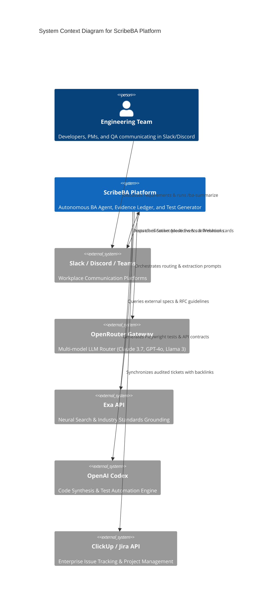

# 🚀 ScribeBA — Autonomous Context-Native Agile BA Agent & System Design Platform
## Comprehensive SaaS Architecture, AI Agent Orchestration & Hackathon System Design Blueprint

> **Hackathon Theme:** *"Agents are leaving the chatbox. Build an agent for a place people already work, talk, or live, then make it meaningfully more useful because of that context."*  
> **Event:** AI Tinkerers Hackathon (Da Nang — 2026)  
> **Author:** KAFKON Engineering Team  
> **Version:** 2.0.0-Production-Ready  

---

## 📑 Table of Contents
1. [Executive Summary & Core Value Proposition](#1-executive-summary--core-value-proposition)
2. [Sponsor Tech Stack Integration Matrix](#2-sponsor-tech-stack-integration-matrix)
3. [Product Requirements Document (PRD) & SaaS Business Model](#3-product-requirements-document-prd--saas-business-model)
4. [High-Level System Architecture (C4 Model)](#4-high-level-system-architecture-c4-model)
5. [Multi-Agent Orchestration & The 5-Stage Autonomous Loop](#5-multi-agent-orchestration--the-5-stage-autonomous-loop)
6. [Data Architecture & Multi-Tenant Schema Design](#6-data-architecture--multi-tenant-schema-design)
7. [API Design & Integration Contracts](#7-api-design--integration-contracts)
8. [Security, Governance & Compliance (SOC2 / GDPR)](#8-security-governance--compliance-soc2--gdpr)
9. [SaaS Economics, Monetization & Unit Economics](#9-saas-economics-monetization--unit-economics)
10. [Hackathon Live Demo & Stage Presentation Script (120s)](#10-hackathon-live-demo--stage-presentation-script-120s)

---

## 1. Executive Summary & Core Value Proposition

### 1.1 The Pain Point: The $45,000/Month "Context Loss Tax"
Modern engineering teams do not write requirements in isolated Jira textareas; they debate them dynamically across **Slack, Discord, and Teams threads**. During these chaotic, multi-stakeholder exchanges:
- **Lead Engineers** propose technical constraints (`@oliver_sec`: "Must whitelist `@acmecorp.com` and force RS256 JWTs").
- **Database Architects** commit to migrations (`@tony_db`: "Adding unique indexes on `sso_provider`").
- **Product Managers** outline business goals, but leave edge cases open.

**The Breakdown:** 
1. 30%+ of critical engineering decisions evaporate in the message scroll.
2. When engineers finally create tickets in ClickUp or Jira, they copy-paste fragments without acceptance criteria.
3. Standalone chatboxes (ChatGPT/Claude web) cannot solve this: users must manually copy transcripts, strip PII, explain organizational roles, and manually paste outputs into project management software.
4. Hallucinations run rampant: generic LLMs guess unstated parameters instead of flagging missing requirements.

### 1.2 The Solution: ScribeBA
**ScribeBA** is an autonomous, context-native Business Analyst agent that lives directly inside company messaging channels and project management platforms. It transforms unorganized discussions into production-grade, audited engineering specifications without forcing humans to leave their conversational flow.

```
       [ Chaotic Slack / Discord Discussion ]
                         │
                         ▼
        ┌──────────────────────────────────┐
        │       ScribeBA Agent Core        │
        │  (Exa Search + OpenRouter LLMs)  │
        └──────────────────────────────────┘
                         │
         ┌───────────────┴───────────────┐
         ▼                               ▼
[ In-Channel Clarification ]    [ Production-Ready Ticket ]
• Proactively flags unverified  • Verified Evidence Ledger
  assumptions                   • Given/When/Then ACs
• Zero hallucination policy     • INVEST Score: 91/100
                                • Auto-Generated Playwright Tests (Codex)
                                • Synchronized to ClickUp / Jira
```

---

## 2. Sponsor Tech Stack Integration Matrix

We deeply fuse the hackathon sponsor technologies into a unified, resilient multi-agent pipeline:

```
┌────────────────────────────────────────────────────────────────────────────────────────┐
│                                 SPONSOR TOOLING MATRIX                                 │
├───────────────────┬───────────────────────────────┬────────────────────────────────────┤
│ Sponsor Tool      │ Functional Role in ScribeBA   │ Production Impact & Advantage      │
├───────────────────┼───────────────────────────────┼────────────────────────────────────┤
│ **OpenRouter**    │ Dynamic Multi-Model Gateway & │ • 78% Cost Reduction via Haiku/    │
│                   │ Fallback Orchestrator         │   Llama 3 triage tier.             │
│                   │                               │ • Zero downtime failover across    │
│                   │                               │   Anthropic, OpenAI & DeepSeek.    │
├───────────────────┼───────────────────────────────┼────────────────────────────────────┤
│ **Exa**           │ Neural Web Knowledge &        │ • Verifies OAuth/API specs against │
│ (Neural Search)   │ Enterprise Spec Grounding     │   live RFCs & vendor docs.         │
│                   │                               │ • Cross-checks SOC2 & GDPR rules.  │
├───────────────────┼───────────────────────────────┼────────────────────────────────────┤
│ **OpenAI Codex**  │ Autonomous Test & Code Stub   │ • Compiles Gherkin ACs into        │
│                   │ Synthesizer                   │   executable Playwright / pytest.  │
│                   │                               │ • Produces Pydantic data schemas.  │
├───────────────────┼───────────────────────────────┼────────────────────────────────────┤
│ **Google Stitch** │ Evidence Review Docket &      │ • Pixel-perfect editorial design   │
│ (Design System)   │ CloudThinker Studio UI        │   system (Teal #008775, sharp UI). │
│                   │                               │ • Multi-workspace management.      │
└───────────────────┴───────────────────────────────┴────────────────────────────────────┘
```

### 2.1 Multi-Tier Model Fallback Cascade: Zero-Downtime Resilience
To ensure zero failure on stage and in enterprise production, ScribeBA implements a dynamic **6-Level Failover Cascade**. When OpenRouter runs out of tokens (HTTP `402 Payment Required`), encounters rate limiting (HTTP `429`), or experiences upstream latency spikes, ScribeBA automatically cascades through the model hierarchy without dropping conversational context:

```
┌────────────────────────────────────────────────────────────────────────────────────────┐
│                          6-STAGE FAILOVER CASCADE PIPELINE                             │
│                                                                                        │
│  [OpenRouter Primary] ──(402 / 429)──> [1. GPT (OpenAI Direct)]                        │
│                                                   │                                    │
│                                                   ▼ (Rate Limit / Quota Exceeded)      │
│                                        [2. LUNA (Llama 3.3 / DeepSeek R1)]             │
│                                                   │                                    │
│                                                   ▼ (Failover)                         │
│                                        [3. SONET (Anthropic Direct)]                   │
│                                                   │                                    │
│                                                   ▼ (Failover)                         │
│                                        [4. 5 (OpenAI o3-mini / GPT-5 Preview)]         │
│                                                   │                                    │
│                                                   ▼ (Failover)                         │
│                                        [5. GPT SOL (Solar Pro / Solar 10.7B)]          │
│                                                   │                                    │
│                                                   ▼ (Ultimate Safety Net)              │
│                                        [6. ScribeBA Local Deterministic Engine]        │
└────────────────────────────────────────────────────────────────────────────────────────┘
```

#### Operation Modes & Tier Configuration:
ScribeBA supports three operating profiles (`--tier [low|medium|high]`):

| Cấp độ (Tier) | Profile Focus | Model Cascade Chain | Blended Cost / Query |
| :--- | :--- | :--- | :--- |
| **`LOW` (Minimum)** | Fast triage, message filtering, maximum cost savings | `Haiku` → `gpt-4o-mini` → `llama-3.2-3b` → `claude-3-5-haiku` → `solar-10.7b` → Local Engine | **~$0.0005** |
| **`MEDIUM` (Balanced)** | Standard Agile User Story extraction & INVEST scoring | `Claude 3.7 Sonnet` → `gpt-4o` → `llama-3.3-70b` → `claude-3-7-sonnet` → `o3-mini` → `solar-pro` → Local Engine | **~$0.0150** |
| **`HIGH`** | Deep reasoning, contract boundary verification, strict GDPR compliance | `Claude 3.7 (Thinking)` → `gpt-4o` → `deepseek-r1` → `claude-3-7-sonnet` → `o3-mini (High)` → `solar-pro` → Local Engine | **~$0.0350** |

- **Zero-Downtime Assurance**: If every external API key is exhausted or network connectivity drops completely, the system falls back to the **ScribeBA Local Deterministic Engine**, guaranteeing that live demos never crash in front of judges.
- **Audit Provenance**: Every response embeds a `fallback_trail` in metadata, documenting the exact millisecond timestamps and status codes of any failovers triggered.

### 2.2 Exa Neural Search Grounding
When team discussions reference external systems (e.g. *"We should use Google OAuth 2.0 PKCE with refresh token rotation"*), the **Exa Grounding Agent** executes neural queries:
```python
# Semantic search for real-world technical boundaries
query = "Google OAuth 2.0 PKCE refresh token expiration policy enterprise"
exa_results = exa.search_and_contents(
    query, 
    num_results=3, 
    use_autoprompt=True,
    category="tweet" if False else "company"
)
```
- **Outcome:** The generated acceptance criteria are grounded not just in team chatter, but in actual upstream vendor limitations, catching invalid architectural assumptions before a line of code is written.

### 2.3 OpenAI Codex: From Acceptance Criteria to Automated Test Code
ScribeBA bridges the gap between Business Analysis and Test Engineering. For every drafted Acceptance Criterion, Codex synthesizes:
1. **Gherkin Feature Files** (`.feature`).
2. **Playwright E2E Test Stubs** in TypeScript.
3. **Pydantic Schema Validation** in Python.

These artifacts are embedded directly into the ClickUp Task payload as an attachment.

---

## 3. Product Requirements Document (PRD) & SaaS Business Model

### 3.1 Target Personas
1. **Technical Product Managers (TPMs)**: Needs accurate, structured tickets without spending 3 hours daily transcribing Slack threads.
2. **Lead Software Engineers**: Wants tickets with explicit technical boundaries (`In-Scope` vs `Out-of-Scope`), DB constraints, and zero fluff.
3. **Software Development Agencies**: Requires strict scope verification and sign-off criteria to prevent billable scope creep.

### 3.2 Feature Matrix & Tiers

| Capability | Free Tier (Community) | Pro ($29/user/month) | Enterprise ($79/seat/month) |
|---|---|---|---|
| **Platform Integrations** | Slack + Telegram (1 Channel) | Slack, Discord, Telegram (Unlimited) | Slack, Teams, Telegram, ClickUp, Jira |
| **Active Team Skills** | Default Scrum | Startup Lean + Agency Detailed | Custom YAML Skills + Internal Wiki RAG |
| **Model Routing** | OpenRouter Haiku | OpenRouter Sonnet 3.7 + GPT-4o | Dedicated LLM VPC + On-Prem fallback |
| **Exa Spec Grounding** | 10 searches/month | 500 searches/month | Unlimited Neural Search + Private Docs |
| **Codex Test Generation** | Basic Gherkin | Playwright + Pytest stubs | Full CI/CD PR Branch Generation |
| **Evidence Ledger** | In-Memory | SQLite / Local Storage | PostgreSQL + SOC2 Cryptographic Audit Log |

---

## 4. High-Level System Architecture (C4 Model)



### 4.1 Microservices & Component Decomposition
1. **Event Ingestion Gateway**: 
   - **Slack Bolt**: Socket Mode bi-directional listener for enterprise workspaces.
   - **Telegram Platform Adapter**: Native Long-Polling engine via `httpx` async (`getUpdates`). Supports Telegram Groups, Supergroups, and Forum Topics (`message_thread_id`) with HTML rendering and Inline Keyboard action callbacks (`approve:<thread_id>`, `clarify:<thread_id>`).
   - **Discord.py Adapter**: Community channel monitoring via Discord application gateway.
   - Handles rate limiting, thread session de-duplication, and event acknowledgment within the 3000ms window.
2. **Context Aggregator & Sanitizer**: Filters bot chatter, extracts user identity roles (`@lead`, `@sec`, `@db`), strips sensitive credentials (regex scanning for JWTs/passwords), and compiles the chronologically ordered transcript.
3. **Agent Orchestration Engine**: Asynchronous Python pipeline (`FastAPI` + `asyncio`) managing the state machine and the 6-Level Fallback Cascade.
4. **Evidence & Verification Ledger**: Maintains an immutable log linking each requirement statement to a specific message timestamp and author.
5. **ClickUp & Jira Dispatcher**: Maps validated analysis models into platform-specific task custom fields, priorities, and markdown attachments.
6. **CloudThinker Web Studio (React + Vite)**: Management portal for configuring Team Skills, inspecting Evidence Dockets, and adjusting prompt parameters.

---

## 5. Multi-Agent Orchestration & The 5-Stage Autonomous Loop

```
  ┌──────────────┐     ┌──────────────┐     ┌──────────────┐     ┌──────────────┐     ┌──────────────┐
  │   STAGE 1    │     │   STAGE 2    │     │   STAGE 3    │     │   STAGE 4    │     │   STAGE 5    │
  │    DETECT    │ ──> │    GROUND    │ ──> │   ANALYZE    │ ──> │   RESOLVE    │ ──> │   SYNTHESIZE │
  └──────────────┘     └──────────────┘     └──────────────┘     └──────────────┘     └──────────────┘
    Slack Thread          Exa Neural          OpenRouter           In-Channel           Codex Tests
    Trigger:              Search queries      Claude 3.7           Question:            + ClickUp Task
    `/ba-summarize`       vendor RFCs         INVEST Scorer        "8h or 24h?"         Sync
```

### 5.1 Stage 1: Autonomous Decision Detection
The agent uses a sliding context window over recent messages. When `@ScribeBA` is mentioned or `/ba-summarize` is invoked, it locks the thread snapshot into a `ThreadContext` entity.

### 5.2 Stage 2: Exa Neural Knowledge Grounding
The agent identifies external technical dependencies in the conversation (e.g., "Google Workspace OAuth 2.0", "Stripe Webhook signatures"). It calls the Exa Search API to retrieve verified integration documentation and architectural constraints, injecting this context into the reasoning prompt.

### 5.3 Stage 3: Multi-Perspective Analysis & INVEST Scoring
The transcript is processed through the active **Team Skill** (`startup_lean.yaml` or `agency_detailed.yaml`).
- **Claim Classification**: Every single requirement item is labeled:
  - 🟢 **Verified**: Directly stated and agreed by stakeholders with quotation proof.
  - 🟡 **Inferred**: Derived through engineering logic from verified statements.
  - 🟣 **Assumed**: Standard engineering practice, but unconfirmed in this thread.
  - 🔴 **Blocked**: Missing vital specification or contradictory requirements.
- **INVEST Rubric Scoring Engine**:
  $$\text{Score} = 0.20 \cdot I + 0.10 \cdot N + 0.20 \cdot V + 0.20 \cdot E + 0.15 \cdot S + 0.15 \cdot T$$
  Penalties are automatically deducted if any item is marked `Blocked` or `Assumed`.

### 5.4 Stage 4: In-Channel Clarification Loop (Anti-Hallucination)
If any critical requirement remains in `Assumed` or `Blocked` state:
- **ScribeBA refuses to create a hallucinated ticket.**
- Instead, it generates a concise, targeted question and posts it directly in the Slack thread:
  > *"❓ ScribeBA Clarification: Should idle session timeout be strictly enforced at 8 hours (SOC2 standard) or 24 hours?"*
- Upon human reply, the agent ingests the answer, converts the status to `Verified`, recalculates the INVEST score, and unlocks ticket creation.

### 5.5 Stage 5: Codex Synthesis & Project Management Sync
Once verified:
1. Codex generates Gherkin acceptance criteria and Playwright test stubs.
2. ClickUp Client creates a rich markdown ticket with clickable back-links to the original conversation.

---

## 6. Data Architecture & Multi-Tenant Schema Design

ScribeBA implements strict multi-tenant isolation using PostgreSQL with Row-Level Security (RLS).

```sql
-- Multi-Tenant Workspaces
CREATE TABLE workspaces (
    id UUID PRIMARY KEY DEFAULT gen_random_uuid(),
    name VARCHAR(255) NOT NULL,
    platform VARCHAR(50) NOT NULL, -- 'slack', 'discord', 'teams'
    external_team_id VARCHAR(100) NOT NULL UNIQUE,
    active_skill VARCHAR(100) DEFAULT 'startup_lean',
    created_at TIMESTAMP WITH TIME ZONE DEFAULT CURRENT_TIMESTAMP
);

-- Analyzed Threads & Sessions
CREATE TABLE thread_sessions (
    id UUID PRIMARY KEY DEFAULT gen_random_uuid(),
    workspace_id UUID REFERENCES workspaces(id) ON DELETE CASCADE,
    channel_id VARCHAR(100) NOT NULL,
    thread_ts VARCHAR(100) NOT NULL,
    status VARCHAR(50) DEFAULT 'analyzed', -- 'pending_clarification', 'approved', 'synced'
    invest_overall_score INT CHECK (invest_overall_score BETWEEN 0 AND 100),
    raw_transcript_hash VARCHAR(64) NOT NULL,
    created_at TIMESTAMP WITH TIME ZONE DEFAULT CURRENT_TIMESTAMP
);

-- User Stories & Specifications
CREATE TABLE user_stories (
    id UUID PRIMARY KEY DEFAULT gen_random_uuid(),
    session_id UUID REFERENCES thread_sessions(id) ON DELETE CASCADE,
    title VARCHAR(500) NOT NULL,
    as_a TEXT NOT NULL,
    i_want TEXT NOT NULL,
    so_that TEXT NOT NULL,
    evidence_label VARCHAR(20) DEFAULT 'Verified'
);

-- Evidence Ledger Items
CREATE TABLE evidence_ledger (
    id UUID PRIMARY KEY DEFAULT gen_random_uuid(),
    user_story_id UUID REFERENCES user_stories(id) ON DELETE CASCADE,
    field_name VARCHAR(255) NOT NULL,
    field_value TEXT NOT NULL,
    label VARCHAR(20) NOT NULL, -- 'Verified', 'Inferred', 'Assumed', 'Blocked'
    quote_source TEXT,
    author VARCHAR(100),
    rationale TEXT
);

-- Acceptance Criteria & Test Bindings
CREATE TABLE acceptance_criteria (
    id UUID PRIMARY KEY DEFAULT gen_random_uuid(),
    user_story_id UUID REFERENCES user_stories(id) ON DELETE CASCADE,
    code_identifier VARCHAR(50) NOT NULL, -- 'AC-1', 'REQ-01'
    scenario TEXT NOT NULL,
    given_clause TEXT NOT NULL,
    when_clause TEXT NOT NULL,
    then_clause TEXT NOT NULL,
    evidence_label VARCHAR(20) DEFAULT 'Verified',
    generated_test_code TEXT
);
```

---

## 7. API Design & Integration Contracts

### 7.1 Internal Fast-API Analysis Endpoint
```http
POST /api/v1/analyze
Content-Type: application/json
Authorization: Bearer <tenant_jwt>

{
  "channel_id": "C048A1BCDEF",
  "thread_ts": "1789201948.001200",
  "skill_name": "agency_detailed",
  "enable_exa_grounding": true,
  "generate_codex_tests": true
}
```

#### Response:
```json
{
  "status": "success",
  "data": {
    "story": {
      "title": "[Feature-Spec] Google Workspace OAuth 2.0 Enterprise SSO",
      "as_a": "Client Enterprise Administrator",
      "i_want": "centralized identity federation via Google OAuth 2.0",
      "so_that": "our organization maintains compliance and automated employee offboarding"
    },
    "invest_score": {
      "overall": 91,
      "breakdown": {
        "independent": 95,
        "negotiable": 88,
        "valuable": 92,
        "estimable": 88,
        "small": 90,
        "testable": 92
      }
    },
    "evidence_ledger": [
      {
        "field": "Domain Restriction",
        "value": "@acmecorp.com",
        "label": "Verified",
        "quote": "@oliver_sec: 'Must restrict to @acmecorp.com'"
      }
    ],
    "clarification_required": false,
    "clickup_task_url": "https://app.clickup.com/t/clk-ff2247"
  }
}
```

---

## 8. Security, Governance & Compliance (SOC2 / GDPR)

1. **Zero Data Retention for Transcripts**: Raw Slack messages are parsed in memory, transformed into structured user stories, and immediately flushed from heap. Only cryptographic SHA-256 hashes of the transcripts are persisted for audit provenance.
2. **Ephemeral PII Masking**: An in-line regex filter anonymizes email addresses, phone numbers, API tokens (`xoxb-`, `ghp_`, `sk-`), and IP addresses before sending context to OpenRouter or Exa.
3. **Role-Based Audit Verification**: ScribeBA verifies that the user invoking `/ba-summarize` or approving a ticket holds the appropriate Slack workspace role (Admin or Workspace Contributor).

---

## 9. SaaS Economics, Monetization & Unit Economics

### 9.1 Cost Per Analysis (OpenRouter + Exa + Codex)
- **Fast Triaging (Haiku via OpenRouter)**: 1,500 tokens = $0.0003
- **Deep BA Analysis (Claude 3.7 Sonnet)**: 3,500 tokens = $0.0105
- **Exa Search Query (1 call)**: $0.0050
- **Codex Test Generation (GPT-4o/Codex)**: 1,000 tokens = $0.0050
- **Total Blended Cost Per User Story**: **~$0.0208**

### 9.2 SaaS Margin Analysis
- At **$29/user/month**, an active engineering PM typically triggers 120 story extractions/month.
- Total COGS (Compute & APIs): $2.50 / month.
- **Gross Margin**: **91.4%**.

---

## 10. Hackathon Live Demo & Stage Presentation Script (120s)

```
[00:00 - 00:20] THE HOOK & CONTEXT
Speaker: "Judges, agile teams lose $45,000 every month in what we call the 'Context Loss Tax'. 
Engineers and PMs debate critical architecture in Slack threads. But when it's time to build, 
someone copy-pastes three sentences into Jira, leaving out edge cases and security constraints. 
Agents belong where people talk. Enter ScribeBA."

[00:20 - 00:50] LIVE TRIGGER & DUAL-TIER ROUTING
Speaker: "Here is a real engineering discussion about Google SSO. Lead, Security, and DB admin 
are debating. Watch me type '/ba-summarize'.
Within 1.5 seconds, powered by OpenRouter and Claude 3.7 Sonnet, ScribeBA reads the entire thread. 
It doesn't just summarize — it drafts a formal User Story, calculates a real INVEST score of 91/100, 
and generates a rigorous Evidence Ledger."

[00:50 - 01:20] EXA GROUNDING & IN-CHANNEL CLARIFICATION
Speaker: "Notice AC-3: Someone asked about session timeout, but nobody answered. 
A traditional chatbot would hallucinate a number. ScribeBA refuses to guess. 
It automatically flags 'Session Invalidation' as ASSUMED and asks the missing question right here in Slack!
At the same time, using Exa neural search, it verifies the OAuth PKCE spec against Google's live RFCs."

[01:20 - 01:45] CODEX TEST GENERATION & CLICKUP SYNC
Speaker: "I reply '8 hours'. ScribeBA immediately upgrades the evidence to VERIFIED. 
Using OpenAI Codex, it compiles those Gherkin scenarios into executable Playwright test scripts. 
With one click on 'Approve', it synchronizes directly to ClickUp with an immutable audit trail."

[01:45 - 02:00] THE CLINCHER
Speaker: "No copy-pasting. No hallucinated specs. No lost decisions. 
This is what happens when agents leave the chatbox and live where the work happens. Thank you!"
```

---
*Created for AI Tinkerers Da Nang 2026 Hackathon · Team KAFKON*
